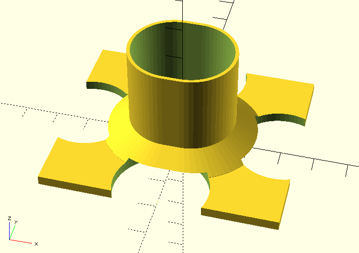

# Fan Stand for Hand Fans

A parametric OpenSCAD design for a functional and elegant hand fan display stand.

## Overview

This OpenSCAD project creates a 3D-printable stand designed to securely hold hand fans. The design features:

- **Stable base plate** (70mm × 60mm) with decorative oval cutouts
- **Hollow oval cylinder** sized to accommodate 30mm × 25mm fan handles
- **Tapered support structure** for enhanced stability and visual appeal
- **Parametric design** allowing easy customization of dimensions



## Features

### Functional Design
- Accommodates standard hand fan handles (30mm × 25mm oval)
- 1mm wall thickness provides strength while minimizing material use
- Wide base prevents tipping when fan is inserted
- No support structures needed for 3D printing

### Aesthetic Elements
- Decorative oval cutouts on all four sides of the base
- Smooth tapered transition from base to cylinder
- Clean, modern appearance suitable for display

### Technical Specifications
- **Base dimensions**: 70mm (L) × 60mm (W) × 3mm (H)
- **Cylinder dimensions**: 32mm (L) × 27mm (W) × 30mm (H)
- **Handle cavity**: 30mm (L) × 25mm (W) × 30mm (H)
- **Material savings**: ~40% through strategic cutouts

## Getting Started

### Prerequisites
- [OpenSCAD](https://openscad.org/) (version 2019.05 or later recommended)
- 3D printer (optional, for physical production)

### Usage
1. Open `Fan stand.scad` in OpenSCAD
2. Modify parameters at the top of the file as needed
3. Press F5 for preview or F6 for full render
4. Export as STL for 3D printing

### Customization
Key parameters can be adjusted at the top of the file:
- `base_length`, `base_width`: Base plate dimensions
- `cylinder_height`: Height of the fan holder
- `handle_length`, `handle_width`: Cavity size for different fan handles
- `cutout_width`, `cutout_length`: Decorative cutout sizing

## 3D Printing Guidelines

### Recommended Settings
- **Layer height**: 0.2-0.3mm
- **Infill**: 15-20%
- **Print orientation**: Base down (as designed)
- **Supports**: None required
- **Print speed**: Standard (50-60mm/s)

### Material Recommendations
- **PLA**: Easy printing, good for indoor display
- **PETG**: More durable, better for frequent use
- **ABS**: Strong and heat resistant

## File Structure

```
scad-model/
├── Fan stand.scad      # Main OpenSCAD design file
├── README.md           # This file
├── .gitignore          # Excludes generated files
└── [generated files]   # STL, OBJ files (not tracked)
```

## Development History

This design evolved through iterative refinement:
1. Started with basic rectangular base and simple cylinder
2. Added oval geometry for better fan handle compatibility
3. Introduced decorative cutouts for material savings and aesthetics
4. Added tapered support for improved structural integrity
5. Optimized parameters for 3D printing and functionality

---

## AI Assistant Rules

*The following section provides guidelines for AI assistants working with this project.*

### OpenSCAD Best Practices

#### Code Organization
- Keep parameters at the top of the file for easy modification
- Use descriptive variable names with units in comments
- Group related parameters together (base, cylinder, cutouts, etc.)
- Include clear module documentation

#### Design Principles
- **Parametric Design**: Use variables instead of hard-coded values
- **Modularity**: Break complex shapes into reusable modules
- **Printability**: Consider 3D printing constraints (overhangs, supports)
- **Functionality**: Ensure the design serves its intended purpose

#### Technical Guidelines

**Smoothness and Quality**
- Always set `$fn` parameter for smooth cylinders (typically 32-128)
- Use higher `$fn` values for final renders, lower for preview
- Consider using `$fa` and `$fs` for more control over faceting

**Boolean Operations**
- Use `difference()` for cutouts and cavities
- Use `union()` for combining solid parts
- Use `hull()` for smooth transitions and organic shapes
- Ensure proper overlap (±0.1mm) to avoid z-fighting

**Measurements and Units**
- Always include units in parameter comments (mm, degrees, etc.)
- Use consistent units throughout (this project uses millimeters)
- Consider manufacturing tolerances (typically ±0.1-0.2mm for 3D printing)

### Project-Specific Constraints

#### Design Limits
- **Base dimensions**: 70mm × 60mm is optimized for stability
- **Cylinder wall thickness**: Minimum 1mm for 3D printing strength
- **Cutout sizing**: Balance aesthetics with structural integrity
- **Heights**: Consider proportions - cylinder shouldn't overwhelm base

#### Functional Requirements
- **Handle compatibility**: Cavity sized for 30mm × 25mm oval handles
- **Printing orientation**: Design prints best base-down (no supports needed)
- **Material usage**: Cutouts reduce material while maintaining strength
- **Stability**: Wide base prevents tipping with inserted fan

### Modification Guidelines

#### When Making Changes
1. **Test parameters**: Verify measurements make sense before implementing
2. **Check clearances**: Ensure cutouts don't interfere with structural elements
3. **Maintain proportions**: Keep design visually balanced
4. **Consider printing**: Avoid unsupported overhangs >45°

#### Common Modifications
- **Scaling**: Adjust base dimensions proportionally
- **Handle sizes**: Modify cavity dimensions for different fan handles
- **Aesthetics**: Customize cutout shapes and sizes
- **Height**: Adjust cylinder height for different fan types

### Code Quality Standards

#### Comments
- Include header with project description and dimensions
- Comment all parameter sections clearly
- Explain complex geometric operations
- Document any non-obvious design decisions

#### Naming Conventions
- Use descriptive variable names: `base_length` not `bl`
- Module names should describe function: `handle_cavity()` not `hole()`
- Constants in UPPERCASE if truly constant

#### Error Prevention
- Use appropriate tolerances for fits
- Validate parameter relationships (e.g., cutouts don't exceed base size)
- Include safety margins for structural elements

### Collaboration Notes
- This design evolved through iterative feedback and refinement
- Balance user requirements with engineering constraints
- Test designs in OpenSCAD before suggesting major changes
- Consider both aesthetic and functional aspects

## Contributing

When contributing to this project:
1. Follow the coding standards outlined above
2. Test changes in OpenSCAD before committing
3. Update documentation for significant modifications
4. Consider both functionality and 3D printability

## License

This project is open source. Feel free to modify and distribute according to your needs.

## Version Control
- Track only source `.scad` files in git
- Generated STL/OBJ files are excluded via `.gitignore`
- Document significant changes in commit messages
- Keep backup of working versions before major modifications
